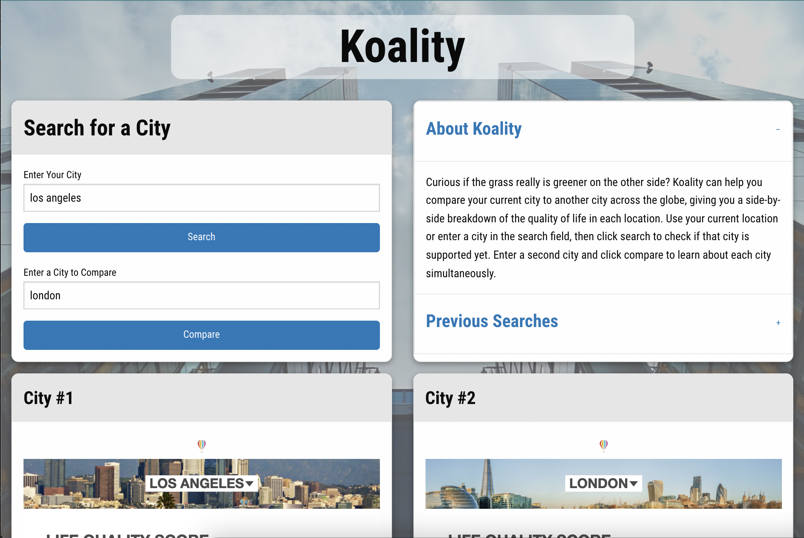

# Quality of Life

## TEAM

Charlton-Hua
Lex-Slovik
Rex-Oliver

## Description

A simple application that can provide users insight to their quality of living, in their respective geo-location, in comparison to another city. This application will run in the browser and feature dynamically updated HTML and CSS, powered by 2 external open source APIs.

## User Story

AS A person living in the SF Bay Area
I WANT to use an app use an app that uses my location to tell me about the quality of living in my current location
SO THAT I can learn more about my community
SO THAT I can also learn more about others

## 3rd Party API

[TELEPORT](https://developers.teleport.org/api/) – Data insight to quality of life depending on city

## Acceptance Criteria
- When a user visits the page, their current location is displayed. (*Not working on GitHub since HTTP is not supported and IPStack requires payment for HTTPS*)
- If they are not in a supported area, a modal appears and directs them to the list of supported cities.
- When the user types in the first input, they can click search to manually enter a city.
- If the searched city is supported, the City #1 column displays a breakdown of the quality of life scores.
- When they enter a city name in the second input, they can click compare.
- When compare is clicked, the City #2 column shows a breakdown of the quality of life scores for that city.
- If the user wishes to change one or both cities, they can enter a new city and click the respective button to load new information in the corresponding column.
- When the user returns to the app, the 3 most recent searches are saved under Previous Searches.
- When the user clicks a previous search button, the columns display the respective cities and their quality of life scores.
# LAYOUT

### Link

[Koality of Life](https://lexslo.github.io/koality-of-life/)